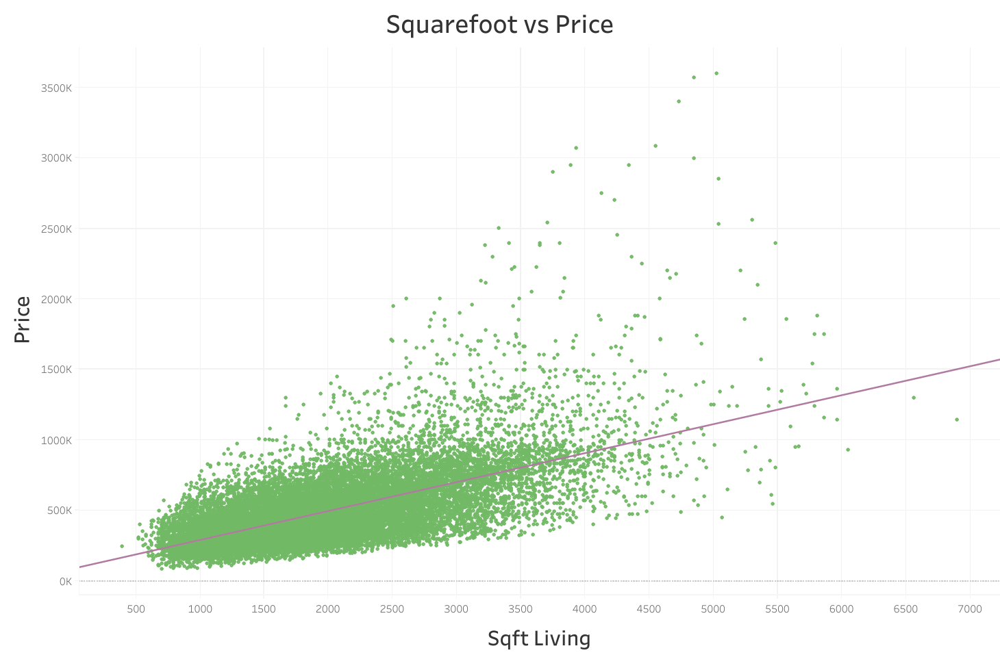

# King County House Analysis
Author: David Cruz, Phil Lannoo

## Overview
This project takes a look at the housing data from King County, WA. Our client wants to ensure a fair price before buying a listed home. We worked with data from the [King County Assessor Website](https://info.kingcounty.gov/assessor/esales/Glossary.aspx?type=r). Our results came from a regression model. The model gave us the ability to predict a fair sale price for a home. It also gave impactful metrics, living area and grade, that have major influence on a final sale price. Our client can use our model to recieve helpful insight before buying a home. 

## Business Problem
A client from King County, WA approached us asking to help ensure a fair sale price for houses in the area. They want us to make a tool for the average home buyer to allow them to compare a predicted price to the actual price.


## Data 
We recieved our data from King County, WA. More specifically, the data came from the [King County Assessor Website](https://info.kingcounty.gov/assessor/esales/Glossary.aspx?type=r). It originally came with ~21k houses worth of data. After filtering and reducing outliers, we were working with ~19k houses. We only worked with house features we belived were important to the average home. These were the basic features such as living area, grade, and year built. By using these features a reggression model was able to be produced.

## Methods
In order to get a better regression model, we first had to remove non-important features that had no relevance or had little impact on the data. Keeping only certain features would reduce our model's complexity. We then filtered our data to focus more on the average houses. This removing houses who had an exceptionally high or low grade. This also included looking at house features. We did not want houses with seven or more bedrooms/bathrooms, this were typically bigger homes than average.

 With our clean data, we used a test train split method to create a regression model. We then took a look at the variables from our clean data set. It was made sure there was low multicollinearity between all the predictive variables. The final model used the most important features (high coefficiant values) without being more complex (using less variables).

 A tool was also created to predict a house's sale price given certain features from the house. Our tool used the regression model to base it's results on. With all the information, we are able to give insight on house features and a fair sale price.

## Results
The regression model is able to account for 57% of the varience in sale price. It was also able to give us the most impactful features of a house by looking at the coeffeciants for each feature. We found the living area of a house and grade are the top important features.

*Average Grades for Houses*


*Squarefoot vs Price*


Although we had decent results, our model also had limitations. The model works better with average houses based on our filtering. Houses with no basement are difficult to predict. Newer houses may be undervalued. Inaccurate grade values may skew predictive results.


## Conclusions
We were able to give a set of recomendations to our client
- If a house is over $116k from the predictive price, we do not recommend buying it and suggest looking for a better listing price. 
- When using our tool to predict, keep in mind the limitations for more accurate results. 
- The living area and condition of a house have a great impact on sale price, so this can help when trying to find a cheaper or more expensive home. 

## Further Analysis
We would like to build a more accurate model. This means further reducing the outliers. Possibly looking at zipcodes and see if that has a higher impact than first thought of. 


## For More Information
Contact: [David Cruz](mailto:dcruzven20@gmail.com)

Contact: [Phil Lannoo](pjlannoo@gmail.com)

```
Repository Structure:

├── Notebooks                           # folder containing code/project notebooks
    ├── David                           # folder containing initial modeling, final modeling, and data cleaning
        ├── Final_Model_Maybe.ipynb     # notebook creating final model
        ├── Rel_Clean_Data.ipynb        # notebook further cleaning data
        └── Work_Notebook.ipynb         # notebook creating initial models
    └── Phil                            # folder containing initial modeling, notes, tool creation, and data cleaning
        ├── DataCleaning.ipynb          # notebook containing initial data cleaning
        ├── Notes.ipynb                 # notebook containing notes to help in structuring the problem
        ├── PredictFunction.ipynb       # notebook where the predict function and take input function were created
        └── ScratchNotebook.ipynb       # notebook for general data exploration and programming
├── data                                # files used in project
├── images                              # images/graphics used in project
├── FinalNotebook.ipynb                 # final code/project notebook
├── House Anylsis.pdf                   # non-technical presentation slides
└── README.md                           # top-level README for reviewers of this project
```